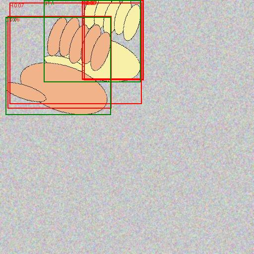
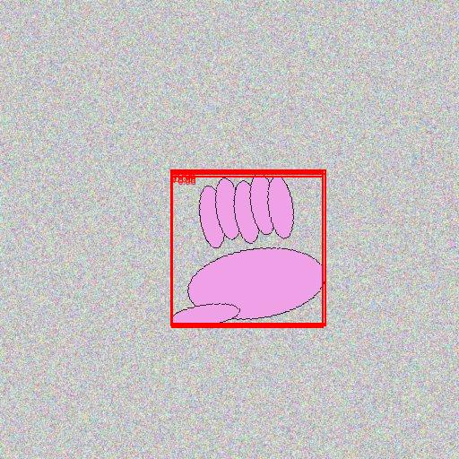
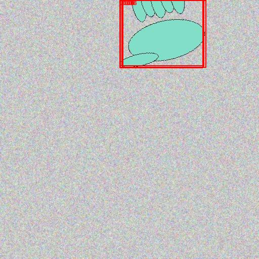

# Детектирование объектов с transfer learning 

Проект решает задачу детектирования объектов на локальном датасете `archive/`

## 1) Установка

```bash
python -m venv .venv
source .venv/bin/activate
pip install -r requirements.txt
```

Если SIFT недоступен
```bash
pip uninstall opencv-python
pip install opencv-contrib-python
```

## 2) Данные

Датасет лежит в папке `archive/`
```
archive/
  images/
  annotations.csv  (filename,width,height,class,xmin,ymin,xmax,ymax)
```

## 3) Transfer Learning: Faster R-CNN или SSD Lite

Обучение (Faster R-CNN)
```bash
python src/train_detector.py --data archive --epochs 15 --batch-size 4 --output runs/sign
```

Обучение (SSD Lite)
```bash
python src/train_detector.py --data archive --epochs 15 --batch-size 4 --output runs/sign_ssd --model ssdlite
```

Оценка (mAP@0.5 IoU)
```bash
python src/evaluate_detector.py --data archive --checkpoint runs/sign/checkpoint_last.pt
```

Инференс и визуализация
```bash
python src/infer_detector.py --data archive --checkpoint runs/sign/checkpoint_last.pt --images archive/images --output runs/sign/preds
```

Если  SSD Lite, то надо добавить `--model ssdlite` в команды оценки и инференса (или использовать чекпоинт, сохраненный новой версией скрипта — он должен подхватить модель автоматически).

## 4) Результаты (что получили)

Ниже зафиксированы результаты, которые получались локально на CPU. Для ускорения оценка mAP выполнялась на 50 изображениях (`--max-samples 50`).

### Лучший прогон (Faster R-CNN, transfer learning)
Команда обучения:
```bash
python src/train_detector.py --data archive --epochs 8 --batch-size 1 --num-workers 0 --output runs/sign_better2 --device cpu --max-train-samples 300 --max-val-samples 60 --eval-every 1
```

Команда оценки:
```bash
python src/evaluate_detector.py --data archive --checkpoint runs/sign_better2/checkpoint_last.pt --device cpu --max-samples 50 --num-workers 0
```

Итог: **mAP@0.5 = 0.0943** (на 50 изображениях).

Примеры предсказаний:
```bash
python src/infer_detector.py --data archive --checkpoint runs/sign_better2/checkpoint_last.pt --images archive/images/image_000000.jpg --output runs/sign_better2/preds --device cpu --score 0.05 --topk 5
```

Скриншоты предсказаний :





### Быстрый прогон (Faster R-CNN)
Команда обучения:
```bash
python src/train_detector.py --data archive --epochs 3 --batch-size 1 --num-workers 0 --output runs/sign_quick --device cpu --max-train-samples 50 --max-val-samples 20 --eval-every 1
```
Итог: **mAP@0.5 = 0.0583** (на 50 изображениях).

### SSD Lite (Single Shot Detector)
Команда обучения:
```bash
python src/train_detector.py --data archive --epochs 10 --batch-size 1 --num-workers 0 --output runs/sign_ssd --model ssdlite --device cpu --max-train-samples 150 --max-val-samples 40 --eval-every 1
```
Итог: **mAP@0.5 = 0.0050** (на 50 изображениях). SSD Lite быстрее, но точность ниже.

### Примечания
- Transfer learning выполнен за счет предобученных весов (`weights="DEFAULT"` в `src/train_detector.py`).
- Низкие значения mAP связаны с ограничением времени обучения и запуском на CPU.
